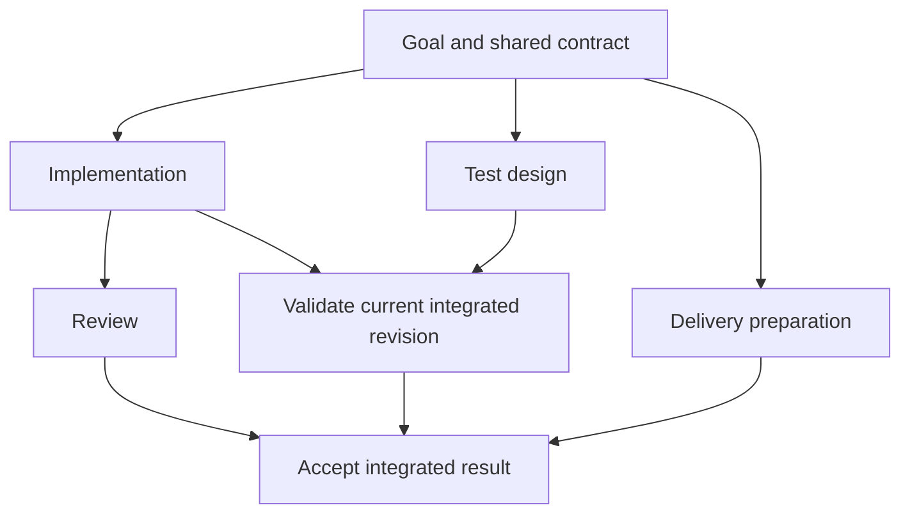
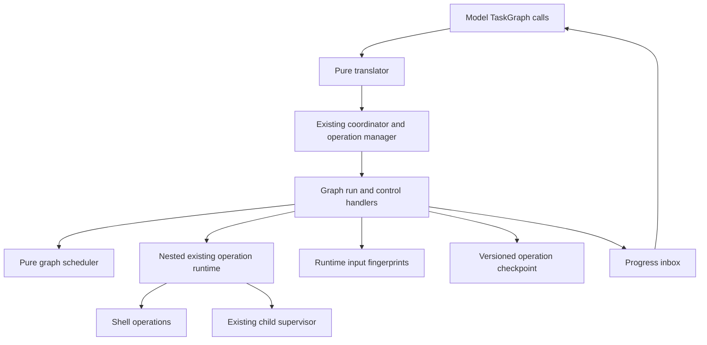
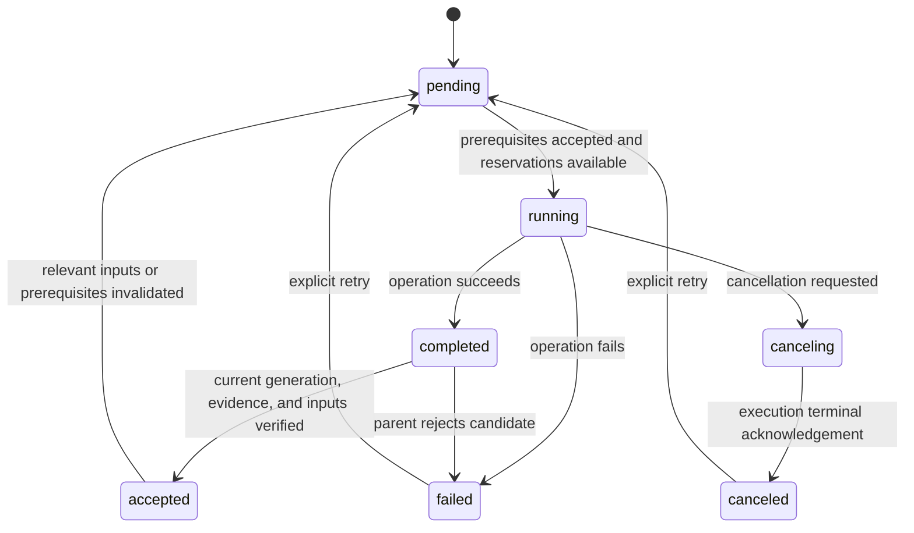

# Adaptive parallel task management

## Goal Capsule

- **Objective:** Unreal-agent finishes goals faster while preserving correctness.
- **Means:** Adaptive DAG scheduling over the existing asynchronous tools and subagents.
- **Product authority:** The Product Contract below records the scope confirmed by the user on 2026-10-10.
- **Open blockers:** None; implementation choices and evaluation workload selection are specified below.

---

## Product Contract

### Summary

Extend unreal-agent with explicit task dependencies and continuous scheduling throughout goal execution.
The agent revises its task graph as it learns and overlaps useful work while preserving acceptance gates.

### Problem Frame

Agents can identify independent work yet execute it sequentially, or wait for an entire batch when one completed task already enables progress.
A long test run can become idle time even when research, review, or preparation could proceed.
The user's motivating evidence is an account of these failures in other coding agents; the conversation does not establish their frequency in unreal-agent.

### Key Decisions

- **Optimize time to a correct result.** Agent count is an implementation choice, rather than a success metric (session-settled: user-directed — chosen over maximizing agents: the user prioritizes faster goal completion with correctness preserved). Governs R4 and the Success Criteria.
- **Use an adaptive task DAG.** A checklist alone cannot express which completions unlock further work (session-settled: user-approved — chosen over prompt-only encouragement: explicit dependencies and continuous scheduling make the desired behavior concrete). Governs R1–R3.
- **Include quality in dependency handling.** Completion and acceptance have distinct meanings (session-settled: user-approved — chosen over trusting worker completion alone: integrated results require acceptance evidence). Governs R7–R11.
- **Bound delegation overhead.** Additional workers must serve useful concurrency (session-settled: user-approved — chosen over unrestricted delegation: the confirmed scope ties delegation to expected time savings). Governs R4–R6.

### Actors

- A1. The user provides a goal and steers its scope.
- A2. The coordinating agent decomposes work, evaluates dependencies, and integrates accepted results.
- A3. Worker agents and asynchronous tools perform assigned work and report findings or results.

### Requirements

**Task graph and scheduling**

- R1. Represent goal-directed work as tasks with explicit dependencies in a directed acyclic graph.
- R2. Revise tasks and dependencies when new findings change the work, preserving the distinction between current and superseded results.
- R3. Start ready work when capacity and safe ownership permit, without waiting for unrelated running tasks.
- R4. Prioritize work that is expected to shorten time to an accepted goal result, accounting for execution and coordination overhead.
- R5. Support concurrency across implementation, research, tests, review, and preparation when their dependencies permit.
- R6. Bound resource use and avoid decomposition or delegation that provides no useful concurrency.

**Ownership and acceptance**

- R7. Assign explicit ownership to concurrent edits and coordinate overlapping changes before allowing conflicting writers to proceed.
- R8. Give each task acceptance conditions and distinguish reported completion from accepted output.
- R9. Bind validation evidence to the inputs or revision checked and invalidate it when relevant changes occur.
- R10. Block dependents of failed or unaccepted tasks while allowing unaffected ready work to continue.
- R11. Declare a goal complete only when required outputs are integrated and required acceptance evidence is current.

### Key Flows

- F1. **Goal execution.** A1 supplies a goal; A2 creates the initial graph, assigns ownership, and launches eligible work; A3 reports results; A2 accepts or revises outputs and starts newly ready dependents. Covers R1–R8.
- F2. **Revision and failure.** A finding, edit, or failed check changes what is trustworthy; A2 updates affected dependencies and acceptance evidence, then continues eligible work until the goal satisfies its completion conditions. Covers R2, R7–R11.

The graph below illustrates dependency overlap; it does not mandate these task names or decomposition for every goal.

### Acceptance Examples

- AE1. **Covers R3, R5.** Given a long test run and independent preparation, the agent advances preparation while tests execute; publishing still obeys the user's authorization.
- AE2. **Covers R3.** Given independent tasks A and B and a task C dependent only on A, accepted completion of A makes C eligible while B remains running.
- AE3. **Covers R7.** Given two proposed writers with overlapping ownership, the agent coordinates the overlap before conflicting edits proceed; disjoint work remains eligible.
- AE4. **Covers R8, R10.** Given a worker's completion report with unmet acceptance conditions, its dependents remain blocked while independent work continues.
- AE5. **Covers R9, R11.** Given successful tests followed by a relevant edit, those tests cannot establish completion for the changed result; affected validation must run against the current inputs.
- AE6. **Covers R2, R10.** Given a newly discovered dependency or failed prerequisite, the agent revises the graph and schedules eligible work without treating superseded acceptance evidence as current.
- AE7. **Covers R4, R6.** Given a small task whose delegation would add overhead without useful overlap, the agent keeps it with one worker.

### Success Criteria

- Representative goals with independent work reach an accepted result faster than a matched serial baseline, with equivalent correctness checks and task scope.
- Evaluation accounts for failed runs, rework, and integration effort rather than comparing only successful worker durations.
- Behavioral acceptance examples hold even when tasks finish out of order or validation becomes stale.
- Token use and coordination overhead accompany timing results; more agents alone never demonstrate success.
- Workloads, repeat counts, resource ceilings, and a meaningful speedup threshold are fixed before evaluation; no speedup is claimed until measured.

### Scope Boundaries

- This work covers goal execution through integration and acceptance, including useful overlap during long-running tools.
- A dedicated orchestration dashboard, distributed workers across hosts, and recursive agent spawning are deferred.
- Provider replacement, publishing permissions, and unrelated runner or TUI redesign are outside this work.
- Existing project instructions, tool authorization, and versioned session compatibility remain constraints on the eventual implementation.

### Dependencies / Assumptions

The existing asynchronous operation runtime and named subagents provide execution capabilities to extend.
The proposal does not assume that prompt changes alone produce reliable scheduling.
No live provider run or scheduling benchmark was performed during this brainstorm.

### Sources / Research

- `harness/contextbuilder/prompts/preamble.md:3–9` already encourages independent parallel tool calls and describes asynchronous execution.
- `harness/coordinator/loop.go:702–740` records operation dependencies per tool call and waits for their terminal states; no general persisted goal/task DAG was found in the inspected coordinator, session, operation, tool, and supervisor paths.
- `harness/coordinator/scheduling_test.go:127–211` covers completion handling while a model request is active; completions do not cancel that request.
- `harness/tool/static.go:98–135` describes separate child contexts, a shared workspace, and parent/child messaging.
- `cmd/internal/subagent/supervisor.go:314–426` starts child processes and delivers their progress to the parent's inbox.
- `cmd/internal/agentrunner/run.go:353–359` and `cmd/unreal-agent-runner/README.md:53–68` show opt-in subagents and the current restriction against children spawning children.

---

## Planning Contract

### Key Technical Decisions

- KTD1. **Reuse durable remote jobs.** A long-running graph operation stores its versioned mutable checkpoint in the remote-job handle; a second handler processes graph control operations. This extends the same boundary used by subagents without adding session item kinds. Implements R1, R2, R3, R11.
- KTD2. **Keep scheduling pure.** A harness graph package validates dependencies, computes critical-path priority from task duration estimates, admits read/write reservations, tracks attempt generations, and separates completion from acceptance. Asynchronous handlers own execution and filesystem inspection. Implements R1–R4, R7, R8, R10.
- KTD3. **Compose existing execution.** Graph tasks use existing shell operations or named child-agent remote operations through a nested operation manager; child snapshots and stable operation IDs live in the graph checkpoint. A graph owns a separate child supervisor and its update channels; handlers are never shared between operation managers. Existing provider selection, inherited tool restrictions, and subagent opt-in remain authoritative. Implements R5, R6.
- KTD4. **Expose atomic graph actions.** One model-visible TaskGraph tool supports start, status, revise, accept, reject, cancel, invalidate, and retry. A run stays pending until all required tasks are accepted; inbox progress exposes blockers and completed candidates while other tasks run. Changes validate atomically, reject cycles, and reject edits that would supersede an active affected attempt until it reaches terminal state. Implements R2, R3, R8, R10, R11.
- KTD5. **Observe inputs at execution time.** Hash declared relevant paths before execution, after completion, and before acceptance; omitted reads conservatively cover the workspace and therefore reserve a shared workspace read lease. Declared writes include generated and build artifacts. Validation read sets must remain unchanged during execution; mutating tasks instead record the resulting output snapshot. Accepted nodes are rechecked before goal completion and downstream admission. File additions, deletions, dirty content, and unsafe path aliases matter; changes invalidate affected acceptance and descendants. Automatic invalidation reaching a running descendant marks its attempt stale, keeps its reservations until execution terminates, and prevents acceptance of that result; explicit revisions affecting running attempts still fail atomically. Implements R9, R11.
- KTD6. **Bound admission.** Default graph concurrency is four, configurable from one to sixteen; admit at most one active graph per handler. Unknown writes reserve the workspace. Ownership reservations persist until child execution actually terminates, including cancellation. Implements R3, R6, R7.

### High-Level Technical Design

Task declarations contain stable IDs, dependencies, an execution command or child prompt, acceptance conditions, relevant input paths, write ownership, and optional duration estimates.
The parent judges semantic acceptance; a successful process exit only produces a candidate result.
Read reservations are shared, writes are exclusive, and directory/file ancestry conflicts are detected.
Snapshot failures block acceptance rather than treating unreadable input as current.

### Assumptions and Boundaries

- Accurate ownership declarations are required; admission prevents conflicting declared graph reservations but cannot confine arbitrary shell code.
- Parent direct tools must avoid overlapping mutations while graph tasks hold reservations; external changes are detected by freshness checks at runtime boundaries.
- Task results and accepted evidence remain accessible through status and operation checkpoints; compaction does not make model memory the authority.
- Revisions of active affected tasks return an actionable error instead of silently replacing live work; independent work remains eligible.
- Cancellation drains nested operations before releasing reservations or reporting terminal graph state.
- No new third-party dependency or provider contract is required. Existing operation and supervisor patterns supply the execution layer; external research would add little to these integration choices.

### Alternatives and Mechanism Sizing

Prompt-only encouragement leaves scheduling and acceptance unenforced, so it cannot deliver the confirmed contract.
A new coordinator-wide task event protocol would require changing session codecs, replay, forks, and observers; remote-job checkpoints provide the needed persistence with fewer changes.
A separate distributed orchestrator and OS-level shell confinement are not built here: the confirmed scope uses local execution and declared ownership, with explicit limits on that guarantee.
These alternatives can be judged from existing boundaries; developing competing storage or process systems would not resolve an additional consequential uncertainty.

---

## Implementation Units

### U1. Pure graph and scheduling semantics

**Goal:** Define validated task state, safe admission, generations, and acceptance transitions.
**Requirements:** R1–R4, R6–R11; F1, F2.
**Dependencies:** None.
**Files:** `harness/taskgraph/graph.go`, `harness/taskgraph/graph_test.go`.
**Approach:** Build the reducer and readiness policy under KTD2 and KTD6; make updates transactional and keep effects outside this package.
**Test scenarios:**
- Covers AE2. A's acceptance enables C while unrelated B runs.
- Covers AE3. Ancestor read/write claims conflict; disjoint writes and shared reads coexist.
- Covers AE4. Completed output cannot satisfy a dependent until accepted.
- Covers AE6. Cycles and invalid revisions leave the previous graph unchanged.
- Reject stale generations and invalidate accepted descendants when a prerequisite changes.
- Rejected candidates block dependents and can be retried; canceled tasks can also be retried.
- Automatically invalidated live descendants retain reservations until terminal and cannot have stale results accepted.
- Critical-path priority and configured capacity choose useful ready work deterministically.
**Verification:** Graph tests demonstrate dependency, ownership, and transition invariants without execution I/O.

### U2. Durable graph execution and freshness

**Goal:** Execute graph tasks through existing asynchronous operations and persist safe checkpoints.
**Requirements:** R2, R3, R5–R11; F1, F2.
**Dependencies:** U1.
**Files:** `harness/taskgraph/runtime.go`, `harness/taskgraph/fingerprint.go`, `harness/taskgraph/runtime_test.go`, `harness/taskgraph/fingerprint_test.go`.
**Approach:** Implement KTD1, KTD3–KTD5 with dependency injection for agent handlers; use existing shell operations and model-visible progress inbox messages.
**Test scenarios:**
- Covers AE1, AE2. Independent real shell tasks overlap and newly accepted dependents start without batch waits.
- Covers AE5. A file changed during or after validation rejects acceptance; absent and deleted inputs alter identity.
- Covers AE6. Failed jobs block affected descendants and explicit retry preserves independent results.
- Restore a nonterminal graph checkpoint without accepting old evidence or confusing attempt IDs.
- Cancellation retains reservations until nested execution is terminal; canceling one task does not stop independent work.
- Omitted reads cover the workspace; declared paths reject unsafe aliases.
- Resume cannot assume an unreachable prior process is terminated: retain blockers until existing execution machinery confirms termination or safely resumes it.
- Unsupported graph checkpoint versions fail explicitly.
**Verification:** Real shell integration and persisted snapshot tests cover runtime behavior beyond the pure graph.

### U3. Model tools and runnable entry points

**Goal:** Make task scheduling available through runner and TUI without bypassing existing tool permissions.
**Requirements:** R1–R11.
**Dependencies:** U1, U2.
**Files:** `harness/tool/taskgraph/taskgraph.go`, `harness/tool/taskgraph/taskgraph_test.go`, `harness/tool/registry.go`, `harness/tool/static.go`, `harness/tool/selection_test.go`, `harness/contextbuilder/prompts/preamble.md`, `cmd/internal/agentrunner/run.go`, `cmd/internal/agentrunner/run_test.go`, `cmd/unreal-agent-tui/run.go`, `cmd/unreal-agent-tui/subagent_test.go`.
**Approach:** Translate graph actions into inert remote plans and register handlers in both entry points. Honor Bash and Agent availability for graph execution, and make TaskGraph unavailable in child-agent mode. Teach the model to identify critical-path work and review candidates while independent work continues. Keep tiny or serial work in direct tools or one task rather than spawning workers without useful overlap (AE7).
**Test scenarios:**
- Pure translation validates commands and emits serialized versioned plans.
- Disallowed Bash or Agent cannot be reached indirectly through a graph.
- A scripted runner model starts a graph, receives candidate progress, accepts results, and finishes only after graph completion.
- TUI setup exposes the same graph tool and lifecycle through existing observer output.
**Verification:** Entry-point integration tests demonstrate reachable behavior and unchanged permission boundaries.

### U4. Documentation and controlled evaluation

**Goal:** Explain the tool contract and measure scheduling against equivalent serial execution.
**Requirements:** R4, R6; runtime portions of the Success Criteria; AE1, AE2, AE4–AE6. AE7 planning quality requires model evaluation.
**Dependencies:** U2, U3.
**Files:** `cmd/unreal-agent-runner/README.md`, `README.md`, `harness/taskgraph/evaluation_test.go`.
**Approach:** Document actions, declarations, acceptance, bounds, resume, and cooperative ownership. Fix workloads and thresholds before running evaluation.
**Test scenarios:**
- Compare five matched serial/parallel runs of independent shell jobs plus a fan-in validation task; both must produce identical checked results.
- Include a dependency chain that offers no parallel benefit and a failed or stale validation case.
- Report complete accepted-goal elapsed time and scheduler/checkpoint overhead, including failed attempts, rather than worker count or selected successful durations.
- Run the timing evaluation explicitly through an environment flag; default CI asserts behavioral concurrency without a speed threshold.
- Separately preregister matched end-to-end model goals, baseline modes (serial and current prompt-driven execution), correctness, total-time/token/rework accounting, repeat counts, resource ceilings, and speed threshold before any provider comparison. Without such live evidence, report goal-level acceleration as unverified rather than achieved.
**Verification:** On the controlled independent workload, median accepted-goal duration improves by at least 20 percent; chain/failure cases preserve correctness. This measures runtime scheduling, not general model planning quality.

---

## Verification Contract

- Run targeted graph, tool, and runner tests with race detection during implementation.
- Run `make test check build` across both Go modules before delivery.
- Run the fixed controlled evaluation and preserve its actual serial/parallel timings and correctness results in the delivery report.
- Independently review the complete branch diff and address valid correctness and integration findings.
- No UI layout changes are planned; TUI lifecycle integration is checked behaviorally.
- Provider-driven scheduling quality remains unverified unless a separately reported live run occurs; synthetic measurements do not establish that claim.

---

## Definition of Done

- U1–U4 satisfy their mapped requirements and behavioral acceptance examples.
- The graph tool works through the actual runner and TUI setup, with permission and session compatibility preserved.
- Runtime checks and the controlled evaluation meet the Verification Contract; failures and unverified claims are reported accurately.
- Abandoned implementations and temporary experiment files are absent from the branch diff.
- The scoped change is independently reviewed, committed, pushed, and delivered as an open PR with CI outcomes reported; merging remains with the user.
